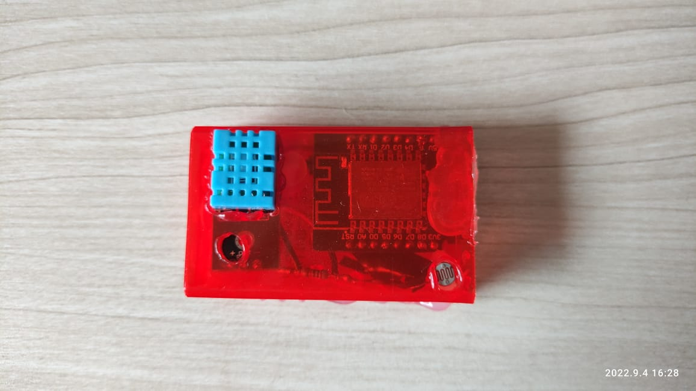
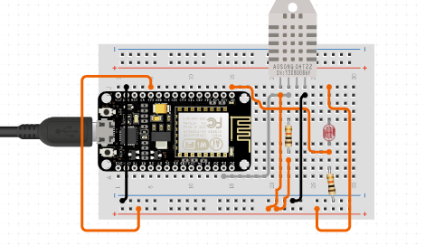

 

  <h3 align="center">Mini Weather Station</h3>
  

    A mini weather station that is in my house, it records temperature, humidity and relative light intensity.
     
    See the <a href="https://thingspeak.com/channels/1839564"><strong>thingspeak channel</strong></a> where the data is stored.
     
     
    <a href="https://github.com/xandao-dev/mini-weather-station"><strong>Explore the docs »</strong></a>
     
    <a href="https://github.com/xandao-dev/mini-weather-station/issue">Report Bug</a>
    ·
    <a href="https://github.com/xandao-dev/mini-weather-station/issues">Request Feature</a>
  

<!-- TABLE OF CONTENTS -->

  
Table of Contents

  <ol>
    <li>
      <a href="#about-the-project">About The Project</a>
      <ul>
        <li><a href="#features">Features</a></li>
        <li><a href="#built-with">Built With</a></li>
      </ul>
    </li>
    <li><a href="#roadmap">Roadmap</a></li>
    <li><a href="#contributing">Contributing</a></li>
    <li><a href="#license">License</a></li>
    <li><a href="#contact">Contact</a></li>
  </ol>

<!-- ABOUT THE PROJECT -->

## About The Project

  

### Features

-   Send data every 10min to thingspeak channel
-   Sends temperature, humidity and relative light intensit
-   Network connection via wifi, with auto reconnect

### Built With

-   [Micropython](https://micropython.org/) - Python for microcontrollers
-   [Wemos D1 Mini](https://www.wemos.cc/en/latest/d1/d1_mini.html) - ESP12F microcontroller (based on ESP8266)
-   [DHT11](https://www.adafruit.com/product/386) - Temperature and humidity sensor
-   [LDR](https://www.adafruit.com/product/161) - Photoresistor (light sensor)

<!-- ROADMAP -->

## Roadmap

See the [open issues](https://github.com/xandao-dev/mini-weather-station/issues) for a list of proposed features (and known issues).

<!-- CONTRIBUTING -->

## Contributing

Contributions are what make the open source community such an amazing place to be learn, inspire, and create. Any contributions you make are **greatly appreciated**.

1. Fork the Project
2. Create your Feature Branch (`git checkout -b feature/AmazingFeature`)
3. Commit your Changes (`git commit -m 'Add some AmazingFeature'`)
4. Push to the Branch (`git push origin feature/AmazingFeature`)
5. Open a Pull Request

<!-- LICENSE -->

## License

Distributed under the MIT License. See [LICENSE](./LICENSE.md) for more information.

Free software =)

<!-- CONTACT -->

## Contact

Alexandre Calil - [Linkedin](https://www.linkedin.com/in/xandao-dev/) - [alexandre@xandao.dev](mailto:alexandre@xandao.dev)

Project Link: [https://github.com/xandao-dev/mini-weather-station](https://github.com/xandao-dev/mini-weather-station)
